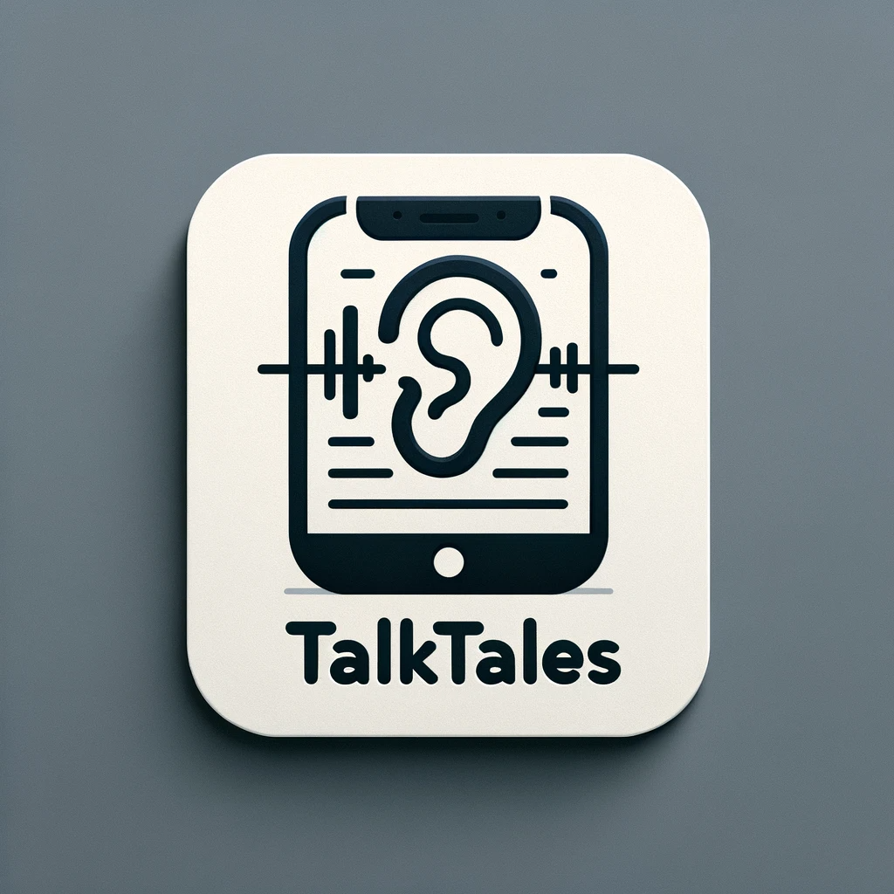

# TalkTales

<div align="center">

</div>

## Table of Contents
1. [Introduction](#introduction)
2. [Motivation](#motivation)
3. [Technologies](#technologies)
4. [Getting Started](#getting-started)
    - [Prerequisites](#prerequisites)
    - [Installation](#installation)
5. [Usage](#usage)
    - [Main Application](#main-application)
    - [Utilities](#utilities)
6. [Roadmap](#roadmap)
7. [Authors](#authors)
8. [License](#license)
## Introduction

TalkTales is a specialized tool designed to assist deaf and hard-of-hearing individuals in their daily interactions. 
Unlike conventional speech-to-text services, TalkTales goes a step further by providing contextual understanding through speaker differentiation.

## Motivation
The primary objective of this project is to develop a specialized tool aimed at assisting deaf individuals in their 
day-to-day interactions. While the overarching goal is to convert spoken language into text, 
the unique aspect of this project lies in its approach to speaker differentiation.
By highlighting changes in the speaker's voice within the transcribed text, our tool aims to offer an 
enhanced contextual understanding, a feature often missing in traditional speech-to-text services.

## Technologies
We leverage the open-source Vosk model for the core speech-to-text translation. 
However, our methodology diverges from mainstream solutions, as we are intent on reducing our dependence on machine learning algorithms. 
The goal is not merely to create a functional tool but to deepen our understanding of sound and voice phenomena. 
Most of the concepts are explained in detail inside the docs directory.

**The development of the repository is currently halted due to high intensity of university tasks**

## Getting Started

### Prerequisites

- Python 3.10+ installed
- `git` installed

### Installation

First, clone the repository to your local machine:
```shell
git clone https://github.com/kryczkal/TalkTales.git ; cd TalkTales
```

Before installation of the dependencies, it is highly recommended to set up a virtual environment inside the project
```shell
python -m venv `myPythonEnv`
source `myPythonEnv`/bin/activate
```
Then install the python dependencies with pip
```shell
pip install -r requirements.txt
```

You are ready to go

## Usage
### Main Application
Run the application with

```shell
python main.py
```

or on linux

```shell
./main.py
```

### Utilities
Various utilities are also provided alongside the main app.
These include:
#### DiarizationTester
Program used to invoke Diarizers components without application frontend. 
It either loads an audio file or connects to live stream. It should then write speaker changes to stdout.
If set to plot (With Settings file), it will also make plot of speakers across time.

##### Usage
```shell
python DiarizationTester.py [optional: filename]
```
or

```shell
./DiarizationTester.py [optional: filename]
```
#### Suggestions Library
The "Suggestions" folder serves as an experimental solution to address the challenges posed by artifacts in speech-to-text algorithms. These algorithms, while impressive, are not flawless. Even minor errors can significantly impede the smoothness of a conversation. To mitigate this, we've implemented a secondary layer of security that scans the transcribed sentences for anomalies. When it identifies an 'unlikely' word or phrase, it flags it as such and offers a more probable alternative. This enhancement leverages the Herbert language model. Unfortunately this approach has a limitation: it's too slow for real-time applications.

It can be tested with:
##### 
```shell
python src/suggestions/testing.py
```
or
```shell
./src/suggestions/testing.py
```
The script will ask for input sentences, and struggle to find improbable utterances in it, and suggest improvements.
#### Matlab Folder
The "Matlab" folder contains a suite of streamlined scripts designed specifically for the acquisition of sound samples across diverse settings. These scripts are integral to our broader project, which aims to analyze human speech in various environments and build a speech diarization tool. To this end, we generated a comprehensive range of auditory visualizations, including wave plots, spectrograms, and mel spectrograms. During the initial phases of our research and development, these visualizations functioned as foundational references, enhancing our understanding of the acoustics and patterns of human speech.

## Roadmap

- [x] Simple diarization model
- [x] Multithreaded backend design
- [ ] Diarization model tuning and upgrades
- [ ] Multi-language support
- [ ] More detailed examples
- [ ] Android application front-end

## Authors

- [Lukasz Kryczka](https://github.com/kryczkal)
- [Jakub Lisowski](https://github.com/Jlisowskyy)
- [Tomasz Mycielski](https://github.com/Al-Gor1thm)
- [Michal Kwiatkowski](https://github.com/KwiatkowskiML)
- [Ernest Molczan](https://github.com/molczane)
- [Wojtek Matejuk](https://github.com/WojciechMat)
- [Mateusz Mikiciuk](https://github.com/chefxxx)
- [Sofiia Kuzmenko](https://youtu.be/dQw4w9WgXcQ)

## License

Distributed under the MIT License. See `LICENSE.txt` for more information.
